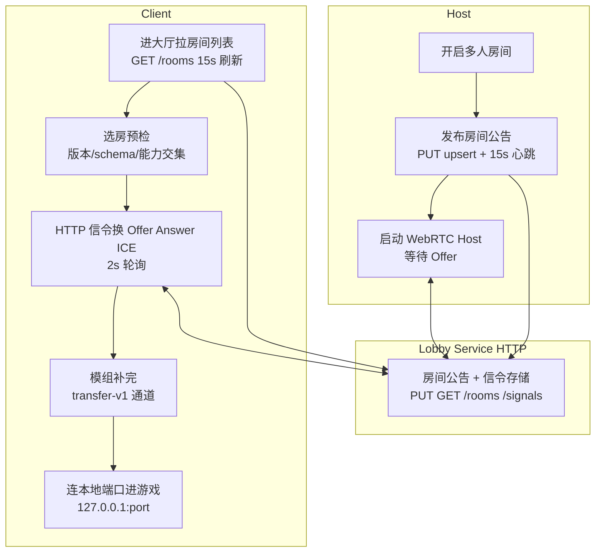
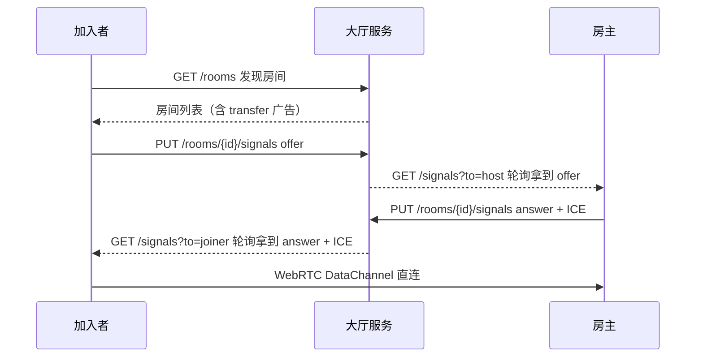

# P2P 联机

P2P 联机用于在没有传统房间服务器转发游戏流量的情况下建立多人游戏连接。当前实现以 WebRTC DataChannel 作为游戏数据通道，并使用
HTTP 大厅服务完成房间发现和 WebRTC 信令交换。

## 当前状态

P2P 联机仍属于实验性功能。它的目标是提高公网环境下的直连成功率，但不能保证所有网络都能连通。

主要特性：

- 游戏流量走 WebRTC DataChannel。
- WebRTC 使用 ICE/STUN/TURN 进行 NAT 穿透。
- 房间发布、房间列表拉取、WebRTC offer/answer/ICE candidate 信令全部走 HTTP 大厅服务（默认
  `https://p2p-lobby-services.shuangx339.workers.dev`）。
- 信令为 HTTP 轮询：发送走 `PUT /rooms/{roomId}/signals`，接收走 `GET /rooms/{roomId}/signals?sinceSeq=&limit=&to=`，默认 2
  秒一轮。
- 加入房间前可自动补完房主的模组与地图。

## 连接流程

创建 P2P 房间时：

1. 游戏先启动普通多人房间。
2. P2P 服务向大厅服务 `PUT /rooms/{roomId}?upsert=1` 发布房间公告，之后每 15 秒心跳一次。
3. 房主启动 WebRTC host 端，等待加入者经由大厅服务发来的 offer。
4. 房间公告中包含 WebRTC 信令方式（固定为 `service`）、ICE server 列表与模组传输广告。

加入 P2P 房间时：

1. 客户端进入大厅后每 15 秒 `GET /rooms` 刷新房间列表。
2. 从房间列表选择房间，客户端先做版本、房间 schema、密码与大厅服务能力交集校验。
3. 客户端与房主经由大厅服务交换 WebRTC offer/answer/ICE candidate。
4. 如房间带模组，先走模组传输流程（见下节）把模组补齐，再建游戏连接。
5. 游戏客户端连接到本地 `127.0.0.1:<临时端口>`，P2P 层在本地 TCP socket 和 DataChannel 之间转发游戏字节流。

简化结构：



信令时序：



## 本地 P2P 配置

所有 P2P 网络设置都从游戏工作目录下的本地 `p2p.toml` 读取。

如果文件不存在，会在启动时按默认值创建。未知键忽略，解析失败回退默认。

示例：

```toml
[webrtc]
iceServers = [
  "stun:stun.l.google.com:19302",
  "stun:stun1.l.google.com:19302",
]

[webrtc.proxy]
bufferSize = 65536
openTimeoutMs = 60000
socketConnectTimeoutMs = 5000
socketReadTimeoutMs = 30000
executorThreads = 4

[discovery.service]
enable = true
urls = [
    "https://p2p-lobby-services.shuangx339.workers.dev"
]
refreshIntervalMs = 15000
timeoutMs = 15000
maxBytes = 262144
maxRoomsPerUrl = 200
signalPollIntervalMs = 2000
signalMaxEnvelopes = 20

[discovery.service.publish]
enable = true
timeoutMs = 15000
updateIntervalMs = 15000
roomTtlMs = 600000
deleteOnClose = true

[lobby]
roomAnnounceIntervalMs = 3000
roomTtlMs = 15000
```

### 房间发现 Service

`[discovery.service].urls` 指向提供房间发现与信令的大厅服务 HTTP 地址，可配多个做冗余（发送 fan-out
到全部可用服务，接收按每个服务端点独立游标）。

`[discovery.service.publish]` 配置房间公告：`updateIntervalMs` 为心跳间隔，`roomTtlMs` 为服务端兜底过期（默认 600 秒），
`deleteOnClose` 为关房时主动 `DELETE` 房间。

`signalPollIntervalMs`（钳制 500~10000 毫秒）与 `signalMaxEnvelopes`（钳制 1~200）调节信令延迟与流量：调小前者降低加入延迟但增加请求量，调大后者适合
ICE 候选较多的网络。

### WebRTC ICE Servers

`[webrtc].iceServers` 控制 WebRTC DataChannel 使用的 ICE server 列表。

支持的格式：

```text
stun:stun.l.google.com:19302
turn:user:pass@example.com:3478
turns:user:pass@example.com:5349
```

如果列表为空或无效，会使用默认免费 STUN：

```text
stun:stun.l.google.com:19302
stun:stun1.l.google.com:19302
```

STUN 只能帮助多数普通 NAT 打洞，不能保证所有网络可用。TURN 是真正的中继兜底，通常需要你自己准备账号或使用第三方服务。

### Proxy 与 Lobby 超时

`[webrtc.proxy]` 与 `[lobby]` 用于调整本地代理 buffer、socket 超时、房间公告间隔与房间
TTL。只有在日志显示网络建立过慢时才建议增大超时；过大的值会让失败连接更晚返回错误。

房间有效期有两层：本地 `lobby.roomTtlMs`（默认 15 秒，房主每次心跳刷新 `expiresAtMs`）与服务端 `publish.roomTtlMs`（默认 600
秒，服务端兜底过期）。

## 与传统联机的区别

传统联机通常需要玩家手动输入 IP，或依赖服务器列表。P2P 联机会自动发现大厅房间，并尝试用 WebRTC 穿透 NAT。
一旦 NAT 穿透成功，游戏数据就直接在玩家之间传输，不经过服务器转发，理论上可以降低延迟和服务器成本。大厅服务只存房间公告与信令包，不转发游戏流量。

但 P2P 不等于 100% 可连接：

- 双方都是普通家用 NAT 时，STUN 通常有机会成功。
- 一方或双方处于严格 NAT、对称 NAT 或运营商 CGNAT 时，纯 STUN 可能失败。
- 没有 TURN 时，WebRTC 打洞失败就没有可靠兜底。

## 故障排查

看不到房间：

- 确认双方使用相同版本的游戏（房间 schema 不匹配会被直接丢弃）。
- 等待几秒后点击刷新（列表每 15 秒拉一次）。
- 检查防火墙是否阻止游戏的网络访问。
- 公网环境下房间发现依赖大厅服务；如果大厅服务不可达或 `enable = false`，房间不会出现。

能看到房间但连接失败：

- 尝试配置 TURN server。
- 检查系统防火墙是否拦截 UDP。
- 如果只配置 STUN，严格 NAT 或 CGNAT 下可能无法连接。
- 查看日志中是否有 `Lobby signaling service is not configured`、`Signaling send queue is full` 或 WebRTC 初始化错误。

模组传输失败：

- 房主显示 `preparing` 时等待打包完成；显示 `unsupported` 说明房内有不支持传输的包，需手动安装。
- 密码输错 3 次会被锁定 30 秒，稍后再试。
- 传输中断可续传；反复校验失败时检查磁盘剩余空间（缓存上限 4GiB，单包上限 512MiB）。

## 限制

- 当前没有内置免费的 TURN 中继服务。
- 默认 STUN 节点不转发流量，只提供地址发现。
- WebRTC native 库需要对应平台支持。
- 大厅服务不可用时无法发现房间与交换信令。
- P2P 功能仍在迭代中，建议遇到问题时保留日志便于排查。
